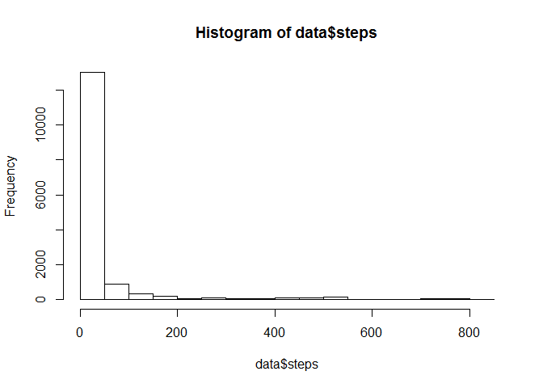
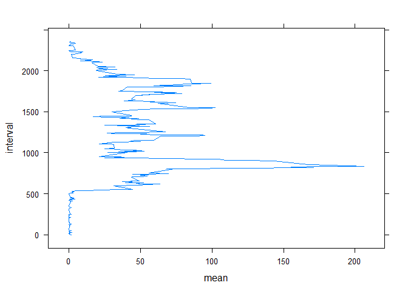
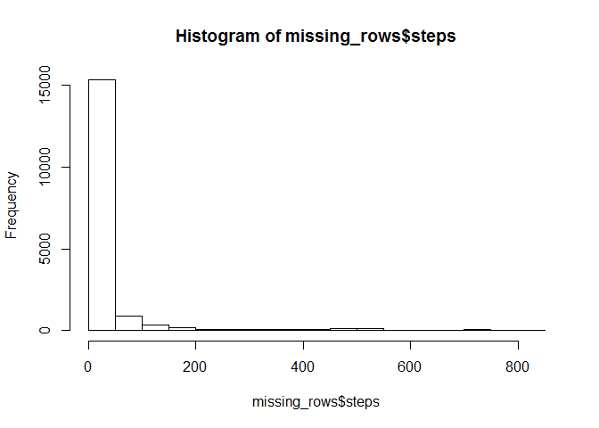
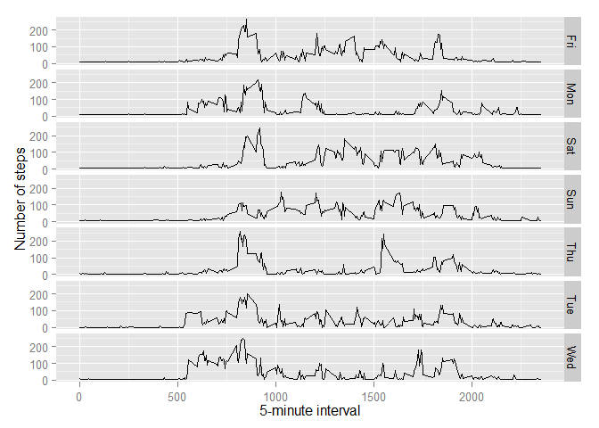

# Reproducible Research: Peer Assessment 1


## Loading and preprocessing the data

##Function to Preprocess data


```r
source("./FileUpload.R") 
data <- FileUpload()
```


## What is mean total number of steps taken per day?

###histogram of the total number of steps taken each day


```r
hist(data$steps)
```

 

###Calculate and report the mean and median total number of steps taken per day


```r
library(dplyr)
```

```
## Warning: package 'dplyr' was built under R version 3.1.2
```

```
## 
## Attaching package: 'dplyr'
## 
## The following object is masked from 'package:stats':
## 
##     filter
## 
## The following objects are masked from 'package:base':
## 
##     intersect, setdiff, setequal, union
```

```r
summary1 <- summarise(group_by(data, date), mean(steps, na.rm = TRUE),median(steps, na.rm = TRUE))
print(summary1)
```

```
## Source: local data frame [61 x 3]
## 
##          date mean(steps, na.rm = TRUE) median(steps, na.rm = TRUE)
## 1  2012-10-01                       NaN                          NA
## 2  2012-10-02                 0.4375000                           0
## 3  2012-10-03                39.4166667                           0
## 4  2012-10-04                42.0694444                           0
## 5  2012-10-05                46.1597222                           0
## 6  2012-10-06                53.5416667                           0
## 7  2012-10-07                38.2465278                           0
## 8  2012-10-08                       NaN                          NA
## 9  2012-10-09                44.4826389                           0
## 10 2012-10-10                34.3750000                           0
## 11 2012-10-11                35.7777778                           0
## 12 2012-10-12                60.3541667                           0
## 13 2012-10-13                43.1458333                           0
## 14 2012-10-14                52.4236111                           0
## 15 2012-10-15                35.2048611                           0
## 16 2012-10-16                52.3750000                           0
## 17 2012-10-17                46.7083333                           0
## 18 2012-10-18                34.9166667                           0
## 19 2012-10-19                41.0729167                           0
## 20 2012-10-20                36.0937500                           0
## 21 2012-10-21                30.6284722                           0
## 22 2012-10-22                46.7361111                           0
## 23 2012-10-23                30.9652778                           0
## 24 2012-10-24                29.0104167                           0
## 25 2012-10-25                 8.6527778                           0
## 26 2012-10-26                23.5347222                           0
## 27 2012-10-27                35.1354167                           0
## 28 2012-10-28                39.7847222                           0
## 29 2012-10-29                17.4236111                           0
## 30 2012-10-30                34.0937500                           0
## 31 2012-10-31                53.5208333                           0
## 32 2012-11-01                       NaN                          NA
## 33 2012-11-02                36.8055556                           0
## 34 2012-11-03                36.7048611                           0
## 35 2012-11-04                       NaN                          NA
## 36 2012-11-05                36.2465278                           0
## 37 2012-11-06                28.9375000                           0
## 38 2012-11-07                44.7326389                           0
## 39 2012-11-08                11.1770833                           0
## 40 2012-11-09                       NaN                          NA
## 41 2012-11-10                       NaN                          NA
## 42 2012-11-11                43.7777778                           0
## 43 2012-11-12                37.3784722                           0
## 44 2012-11-13                25.4722222                           0
## 45 2012-11-14                       NaN                          NA
## 46 2012-11-15                 0.1423611                           0
## 47 2012-11-16                18.8923611                           0
## 48 2012-11-17                49.7881944                           0
## 49 2012-11-18                52.4652778                           0
## 50 2012-11-19                30.6979167                           0
## 51 2012-11-20                15.5277778                           0
## 52 2012-11-21                44.3993056                           0
## 53 2012-11-22                70.9270833                           0
## 54 2012-11-23                73.5902778                           0
## 55 2012-11-24                50.2708333                           0
## 56 2012-11-25                41.0902778                           0
## 57 2012-11-26                38.7569444                           0
## 58 2012-11-27                47.3819444                           0
## 59 2012-11-28                35.3576389                           0
## 60 2012-11-29                24.4687500                           0
## 61 2012-11-30                       NaN                          NA
```

## What is the average daily activity pattern?

###average number of steps taken, averaged across all days (y-axis)


```r
library(lattice)
summary2 <- summarise(group_by(data,interval), mean(steps, na.rm = TRUE))
names(summary2) <- c("interval", "mean")
xyplot(interval~mean, data= summary2,type="l")
```

 


###Which 5-minute interval, on average across all the days in the dataset, contains the maximum number of steps?


```r
maxmeaninterval <- filter(summary2, mean >= 200)
print(maxmeaninterval)
```

```
## Source: local data frame [1 x 2]
## 
##   interval     mean
## 1      835 206.1698
```

## Imputing missing values

### Calculate and report the total number of missing values in the dataset


```r
missing_rows <- mutate(data, is.na(steps))
names(missing_rows)<- c("steps","date","interval","step_NA")
missing_count <- summarise(missing_rows, sum(step_NA))
print(missing_count)
```

```
##   sum(step_NA)
## 1         2304
```

### Devise a strategy for filling in all of the missing values in the dataset. 


```r
missing_rows <-  mutate(missing_rows, mean(steps, na.rm = TRUE))
names(missing_rows)<- c("steps","date","interval","steps_NA","mean_all")
missing_rows$steps[missing_rows$steps_NA == TRUE ] <- missing_rows$mean_all
```

```
## Warning in missing_rows$steps[missing_rows$steps_NA == TRUE] <-
## missing_rows$mean_all: number of items to replace is not a multiple of
## replacement length
```

###histogram of the total number of steps taken each day after updating missing 


```r
hist(missing_rows$steps)
```

 

###Calculate and report the mean and median total number of steps taken per day


```r
library(dplyr)
summary3 <- summarise(group_by(missing_rows, date), mean(steps, na.rm = TRUE),median(steps, na.rm = TRUE))
print(summary3)
```

```
## Source: local data frame [61 x 3]
## 
##          date mean(steps, na.rm = TRUE) median(steps, na.rm = TRUE)
## 1  2012-10-01                37.3825996                     37.3826
## 2  2012-10-02                 0.4375000                      0.0000
## 3  2012-10-03                39.4166667                      0.0000
## 4  2012-10-04                42.0694444                      0.0000
## 5  2012-10-05                46.1597222                      0.0000
## 6  2012-10-06                53.5416667                      0.0000
## 7  2012-10-07                38.2465278                      0.0000
## 8  2012-10-08                37.3825996                     37.3826
## 9  2012-10-09                44.4826389                      0.0000
## 10 2012-10-10                34.3750000                      0.0000
## 11 2012-10-11                35.7777778                      0.0000
## 12 2012-10-12                60.3541667                      0.0000
## 13 2012-10-13                43.1458333                      0.0000
## 14 2012-10-14                52.4236111                      0.0000
## 15 2012-10-15                35.2048611                      0.0000
## 16 2012-10-16                52.3750000                      0.0000
## 17 2012-10-17                46.7083333                      0.0000
## 18 2012-10-18                34.9166667                      0.0000
## 19 2012-10-19                41.0729167                      0.0000
## 20 2012-10-20                36.0937500                      0.0000
## 21 2012-10-21                30.6284722                      0.0000
## 22 2012-10-22                46.7361111                      0.0000
## 23 2012-10-23                30.9652778                      0.0000
## 24 2012-10-24                29.0104167                      0.0000
## 25 2012-10-25                 8.6527778                      0.0000
## 26 2012-10-26                23.5347222                      0.0000
## 27 2012-10-27                35.1354167                      0.0000
## 28 2012-10-28                39.7847222                      0.0000
## 29 2012-10-29                17.4236111                      0.0000
## 30 2012-10-30                34.0937500                      0.0000
## 31 2012-10-31                53.5208333                      0.0000
## 32 2012-11-01                37.3825996                     37.3826
## 33 2012-11-02                36.8055556                      0.0000
## 34 2012-11-03                36.7048611                      0.0000
## 35 2012-11-04                37.3825996                     37.3826
## 36 2012-11-05                36.2465278                      0.0000
## 37 2012-11-06                28.9375000                      0.0000
## 38 2012-11-07                44.7326389                      0.0000
## 39 2012-11-08                11.1770833                      0.0000
## 40 2012-11-09                37.3825996                     37.3826
## 41 2012-11-10                37.3825996                     37.3826
## 42 2012-11-11                43.7777778                      0.0000
## 43 2012-11-12                37.3784722                      0.0000
## 44 2012-11-13                25.4722222                      0.0000
## 45 2012-11-14                37.3825996                     37.3826
## 46 2012-11-15                 0.1423611                      0.0000
## 47 2012-11-16                18.8923611                      0.0000
## 48 2012-11-17                49.7881944                      0.0000
## 49 2012-11-18                52.4652778                      0.0000
## 50 2012-11-19                30.6979167                      0.0000
## 51 2012-11-20                15.5277778                      0.0000
## 52 2012-11-21                44.3993056                      0.0000
## 53 2012-11-22                70.9270833                      0.0000
## 54 2012-11-23                73.5902778                      0.0000
## 55 2012-11-24                50.2708333                      0.0000
## 56 2012-11-25                41.0902778                      0.0000
## 57 2012-11-26                38.7569444                      0.0000
## 58 2012-11-27                47.3819444                      0.0000
## 59 2012-11-28                35.3576389                      0.0000
## 60 2012-11-29                24.4687500                      0.0000
## 61 2012-11-30                37.3825996                     37.3826
```

```r
summary4 <-summarise(missing_rows,mean(steps),median(steps))
print(summary4)
```

```
##   mean(steps) median(steps)
## 1     37.3826             0
```

## Are there differences in activity patterns between weekdays and weekends?

###Create a new factor variable in the dataset


```r
library(dplyr)
missing_rows<- mutate(missing_rows, weekdays(as.Date(date),abbreviate=TRUE))
names(missing_rows)<-c("steps", "date", "interval","steps_NA","mean_all","weekday")
```

###5-minute interval plot


```r
library(ggplot2)
```

```
## Warning: package 'ggplot2' was built under R version 3.1.2
```

```r
averages <- aggregate(steps ~ interval + weekday, data=missing_rows, mean) 
ggplot(averages, aes(interval, steps)) + geom_line() + facet_grid(weekday ~ .) + 
xlab("5-minute interval") + ylab("Number of steps") 
```

 


